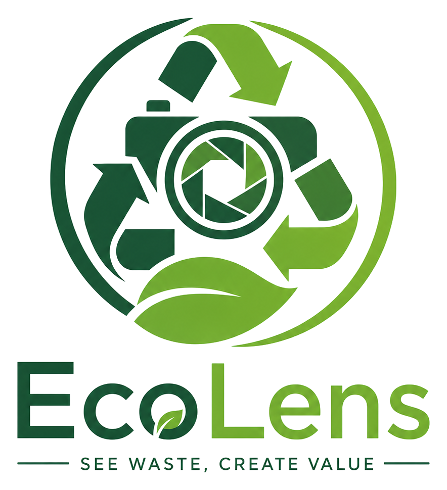
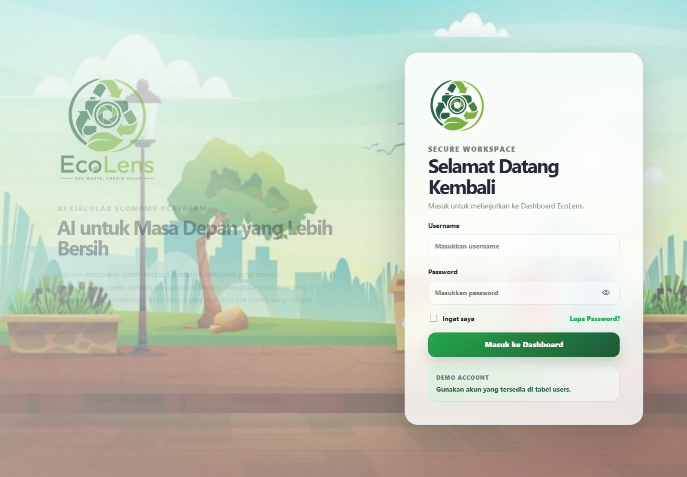
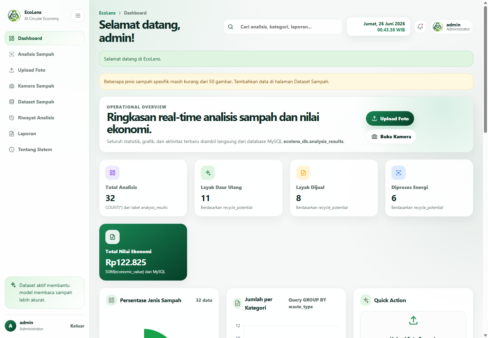
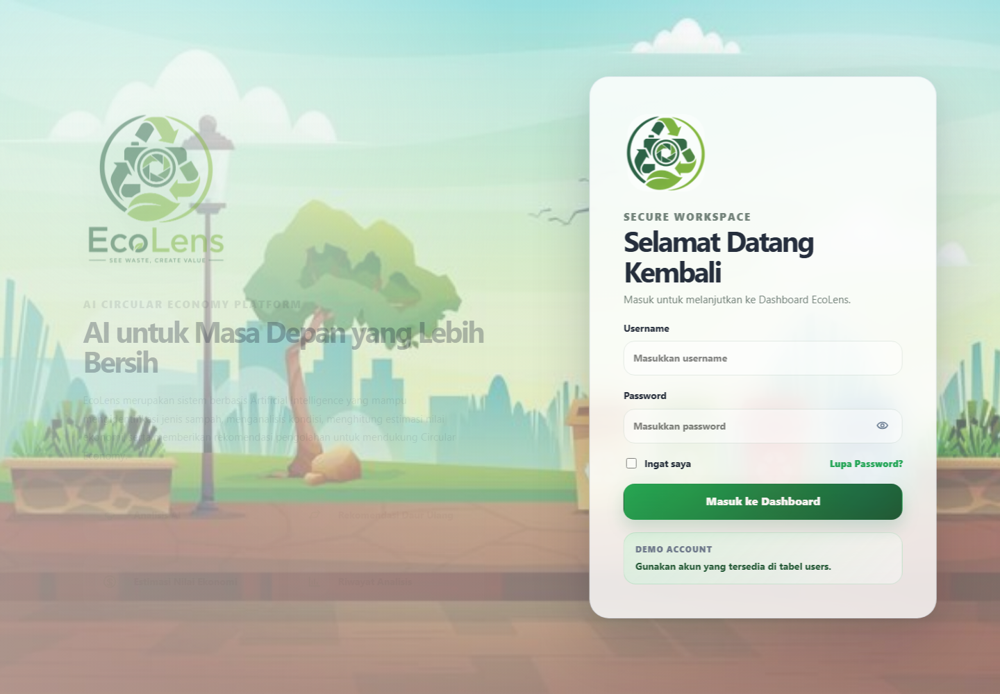
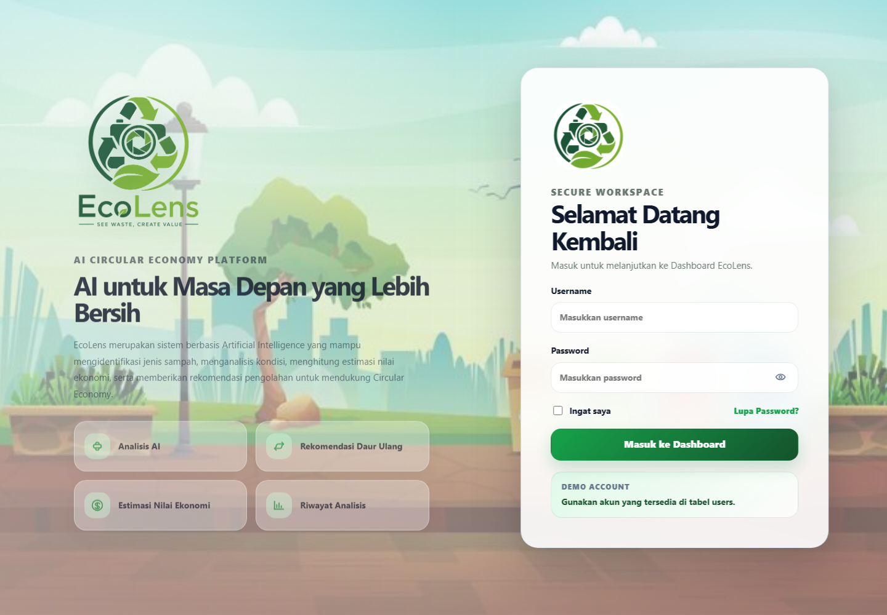
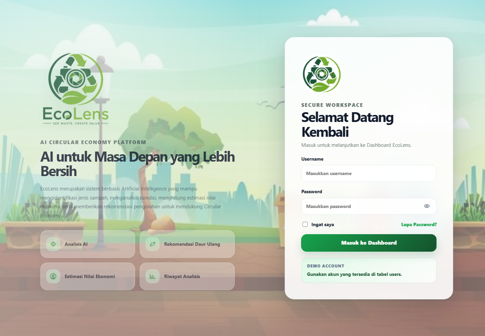
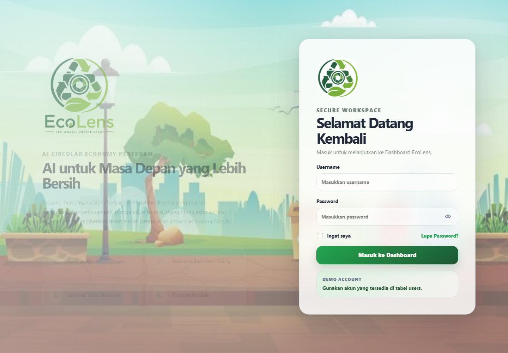
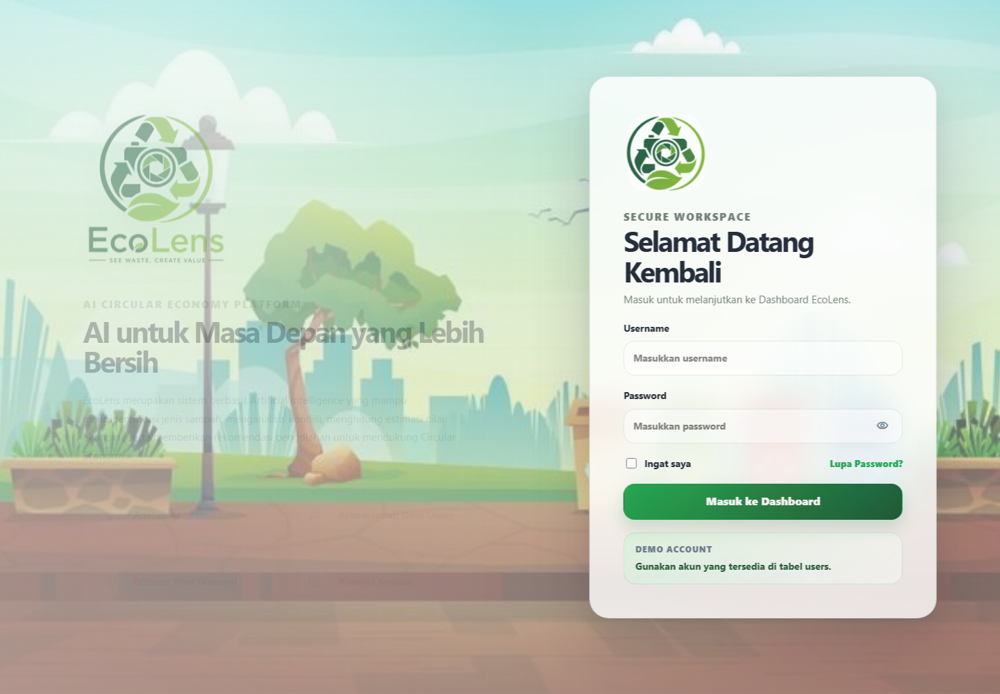
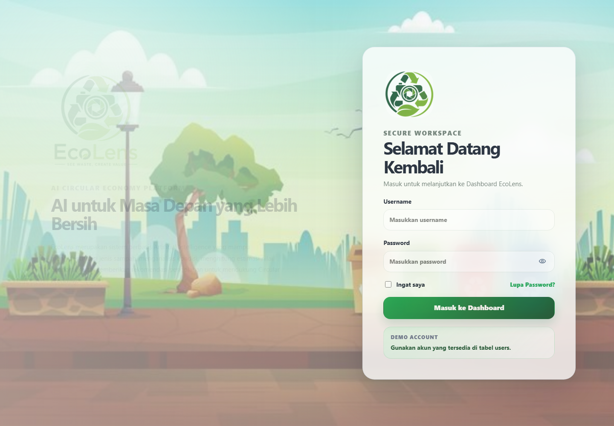
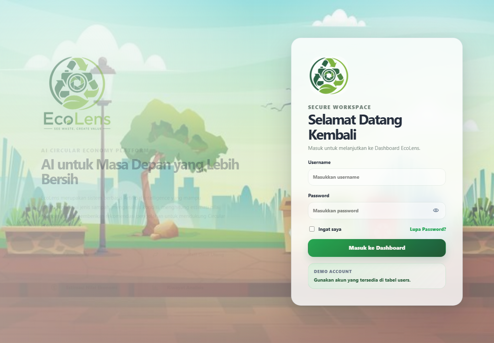

# EcoLens


<p align="center">
  
</p>

**EcoLens** adalah aplikasi web berbasis Flask dan Artificial Intelligence untuk mengidentifikasi jenis sampah secara spesifik, menghitung estimasi nilai ekonomi, dan memberi rekomendasi pengolahan sampah untuk mendukung circular economy.

Judul lengkap project:

> Sistem Rekomendasi Daur Ulang Sampah Menggunakan Artificial Intelligence untuk Mendukung Circular Economy

## Permasalahan

Pemilahan sampah masih sering dilakukan secara manual dan berhenti pada kategori umum seperti plastik, kertas, logam, atau kaca. Untuk kebutuhan edukasi, pengelolaan, dan estimasi ekonomi, kategori tersebut belum cukup informatif karena pengguna perlu mengetahui objek yang lebih spesifik seperti botol plastik, kardus, kaleng minuman, kulit pisang, atau kabel USB.

## Solusi

EcoLens menyediakan sistem rekomendasi berbasis AI yang:

- Mengidentifikasi objek sampah secara spesifik.
- Memetakan objek ke kategori induk.
- Menilai kondisi sampah.
- Menghitung estimasi nilai ekonomi.
- Memberikan rekomendasi pengolahan.
- Menyimpan riwayat analisis ke MySQL.
- Menampilkan dashboard, laporan, grafik, dan dataset manager.

## Fitur Utama

- Login berbasis tabel `users` di MySQL.
- Dashboard modern dengan statistik dan grafik real dari database.
- Upload foto untuk analisis sampah.
- Kamera browser/OpenCV untuk capture sampah.
- Deteksi jenis spesifik seperti Botol Plastik, Kardus, Kaleng Minuman, Botol Kaca, Kulit Pisang, Kabel USB, dan objek umum Indonesia lainnya.
- Mapping otomatis dari jenis spesifik ke kategori induk: Plastik, Kertas, Logam, Kaca, Organik, Elektronik, Karet/Kain, dan Campuran.
- Tabel referensi `waste_items` berisi 90 jenis sampah spesifik.
- Riwayat analisis dan laporan.
- Export laporan ke Excel dan PDF.
- Dataset manager dengan struktur `raw`, `categorized`, `specific`, `train`, `valid`, `test`, dan `unknown`.
- Script download dataset publik legal.
- Script auto-sort dataset dua tahap.
- Training YOLO custom melalui `utils/train_yolo.py`.

## Teknologi

| Area | Teknologi |
| --- | --- |
| Backend | Python, Flask |
| Database | MySQL / phpMyAdmin Laragon, PyMySQL |
| AI | Ultralytics YOLO, TensorFlow-ready structure, OpenCV |
| Frontend | HTML, CSS, JavaScript, Chart.js |
| Dataset | Pillow, tqdm, Kaggle API optional |
| Export | openpyxl, ReportLab |

## Struktur Folder

```text
sistem-daur-ulang-sampah/
├── app.py
├── requirements.txt
├── run.bat
├── static/
│   ├── css/
│   ├── js/
│   ├── img/
│   ├── uploads/
│   └── captures/
├── templates/
├── utils/
│   ├── database.py
│   ├── detector.py
│   ├── dataset_manager.py
│   ├── download_dataset.py
│   ├── sort_dataset.py
│   ├── seed_demo_data.py
│   ├── train_yolo.py
│   └── waste_catalog.py
├── models/
├── dataset/
├── dataset_yolo/
└── docs/
    └── screenshots/
```

## Screenshot Website

Screenshot harus berasal dari aplikasi lokal asli, bukan mockup.

| Halaman | Screenshot |
| --- | --- |
| Login |  |
| Dashboard |  |
| Analisis Sampah |  |
| Upload Foto |  |
| Kamera |  |
| Dataset |  |
| Riwayat |  |
| Laporan |  |
| Tentang |  |

## Database

Database default:

```text
ecolens_db
```

Tabel utama:

- `analysis_results`
- `waste_items`
- `dataset_images`
- `users`

Konfigurasi dapat disesuaikan melalui environment variable:

```powershell
$env:ECOLENS_MYSQL_HOST="127.0.0.1"
$env:ECOLENS_MYSQL_PORT="3306"
$env:ECOLENS_MYSQL_USER="root"
$env:ECOLENS_MYSQL_PASSWORD=""
$env:ECOLENS_MYSQL_DATABASE="ecolens_db"
$env:ECOLENS_SECRET_KEY="change-this-secret"
```

Untuk membuat user admin pertama pada instalasi baru:

```powershell
$env:ECOLENS_ADMIN_USERNAME="admin"
$env:ECOLENS_ADMIN_PASSWORD="gunakan-password-kuat"
```

## Instalasi

1. Clone repository:

   ```powershell
   git clone https://github.com/rahmawati6/Smart-Waste-Detection.git
   cd Smart-Waste-Detection
   ```

2. Buat virtual environment:

   ```powershell
   python -m venv .venv
   .\.venv\Scripts\activate
   ```

3. Install dependency:

   ```powershell
   pip install -r requirements.txt
   ```

4. Salin konfigurasi:

   ```powershell
   copy .env.example .env
   ```

5. Pastikan MySQL Laragon aktif.

6. Jalankan aplikasi:

   ```powershell
   python app.py
   ```

   Atau:

   ```powershell
   .\run.bat
   ```

7. Buka:

   ```text
   http://127.0.0.1:5000
   ```

## Demo Account

Untuk lingkungan demo lokal yang sudah disiapkan:

```text
Username: admin
Password: ecolens123
```

Untuk repository publik, jangan commit password asli. Gunakan `.env` lokal atau seed database lokal.

## Dataset

Dataset besar tidak disertakan ke repository karena ukuran file. Folder dataset sudah dikecualikan dari Git melalui `.gitignore`.

Struktur dataset:

```text
dataset/
├── raw/
│   └── semua_gambar_awal/
├── categorized/
│   ├── plastik/
│   ├── kertas/
│   ├── logam/
│   ├── kaca/
│   ├── organik/
│   ├── elektronik/
│   ├── karet_kain/
│   └── campuran/
├── specific/
│   ├── plastik/
│   │   ├── botol_plastik/
│   │   ├── gelas_plastik/
│   │   └── ...
│   └── ...
├── train/
├── valid/
├── test/
└── unknown/
```

Command dataset:

```powershell
python utils\download_dataset.py
python utils\sort_dataset.py
python utils\auto_fill_specific_dataset.py
python utils\dataset_manager.py --count
python utils\dataset_manager.py --clean
python utils\dataset_manager.py --split
```

Jika dataset Kaggle dibutuhkan, siapkan `kaggle.json` di:

```text
C:\Users\<username>\.kaggle\kaggle.json
```

## Training YOLO

Model besar tidak diupload ke GitHub. Letakkan model custom pada:

```text
models/yolov8_waste.pt
```

Fallback model ringan:

```text
models/yolov8n.pt
```

Training:

```powershell
python utils\train_yolo.py
```

Output training dan bobot model besar harus tetap berada di lokal dan tidak di-commit.

## Model AI

File berikut tidak diupload karena ukuran besar:

- `models/yolov8_waste.pt`
- `models/classifier_model.h5`
- output training di `runs/`

Jika model belum tersedia, aplikasi tetap dapat berjalan dengan fallback detector dan struktur mapping spesifik dari `waste_catalog.py`.

## Roadmap

- [x] Dashboard data real dari MySQL.
- [x] Dataset spesifik per jenis objek.
- [x] Verifikasi hasil analisis sebelum disimpan.
- [x] Export laporan Excel/PDF.
- [ ] Training YOLO custom dengan dataset spesifik penuh.
- [ ] Role user multi-level.
- [ ] REST API publik.
- [ ] Docker Compose untuk deployment.
- [ ] CI/CD GitHub Actions.

## Contribution

Kontribusi sangat terbuka. Silakan baca [CONTRIBUTING.md](CONTRIBUTING.md) sebelum membuat issue atau pull request.

## Security

- Jangan commit `.env`, credential, API key, database lokal, dataset besar, upload pengguna, atau model besar.
- Gunakan secret key yang kuat untuk production.
- Validasi upload dibatasi pada JPG/JPEG/PNG.
- Query database menggunakan parameterized query via PyMySQL.

## License

Project ini menggunakan lisensi MIT. Lihat [LICENSE](LICENSE).

## Developer

EcoLens dikembangkan sebagai project AI waste recommendation system untuk mendukung circular economy dan pengelolaan sampah berbasis data.
